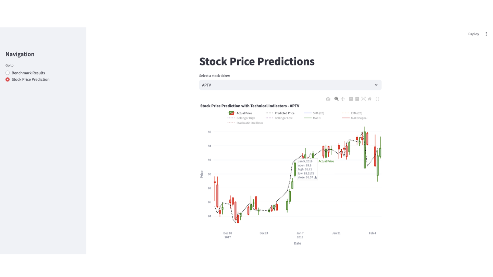

# Stock Price Prediction (S&P 500)

A three-part data engineering and analysis project built on five years of S&P 500 stock price data. The project benchmarks storage formats and dataframe libraries, trains machine learning models with technical indicators, and delivers results through an interactive Streamlit dashboard.

---

## What Was Built

**Part 1 - Storage Benchmarking:** Compared CSV vs Parquet (Snappy compression) read performance across three dataset scales to evaluate which format holds up as data grows.

**Part 2 - Dataframe and ML Benchmarking:** Compared Pandas vs Polars for data manipulation and feature engineering. Applied four technical indicators to enrich the dataset, then trained Linear Regression and Random Forest models to predict next-day closing prices.

**Part 3 - Interactive Dashboard:** Built a two-panel Streamlit dashboard to visualize benchmark results and explore stock price predictions with overlaid technical indicators across any ticker in the dataset.

---

## Dashboard



*Interactive Streamlit dashboard - Panel A shows storage and model benchmarks, Panel B shows actual vs predicted prices with technical indicators for any selected ticker.*

---

## Storage Benchmark Results

Parquet with Snappy compression consistently outperformed CSV, with the gap widening significantly at scale.

| Scale | CSV Read Time | Parquet Read Time | Speedup |
|---|---|---|---|
| 1x (baseline) | 471 ms | 99.5 ms | 4.7x faster |
| 10x | 11.2 s | 967 ms | 11.6x faster |
| 100x | 78 s | 41.6 s | 1.9x faster |

At 1x and 10x scale, Parquet is clearly the faster format. At 100x scale (simulating extreme data growth), both formats slow significantly: Parquet still outperforms but the gap narrows, reflecting real-world limits of columnar reads on very large files.

---

## ML Model Results

Four technical indicators were engineered as features: Simple Moving Average (SMA-20), Exponential Moving Average (EMA-20), MACD, and Bollinger Bands. Two algorithms were trained and evaluated using an 80/20 train-test split.

| Model | MAE | MSE | R2 Score |
|---|---|---|---|
| Linear Regression (Pandas) | 57.89 | 16,435 | -0.01 |
| Linear Regression (Polars) | 57.51 | 16,498 | -0.01 |
| Random Forest (Pandas) | 62.61 | 17,011 | -0.04 |
| Random Forest (Polars) | 60.98 | 18,231 | -0.12 |

The negative R2 scores confirm what financial literature widely supports: technical indicators alone are insufficient for reliable next-day price prediction. Stock prices are driven by factors well outside the scope of moving averages and momentum signals. The value of the ML component here is in the benchmarking methodology: comparing how Pandas and Polars handle the same modeling pipeline, rather than in prediction accuracy.

---

## Tech Stack

- **Python** - pandas, polars, scikit-learn, streamlit, plotly, pyarrow
- **Storage formats** - CSV, Parquet (Snappy compression)
- **ML algorithms** - Linear Regression, Random Forest
- **Technical indicators** - SMA, EMA, MACD, Bollinger Bands
- **Dashboard** - Streamlit with Plotly interactive charts

---

## Project Structure

```
Stock-Price-Prediction/
├── part1.ipynb              # Storage benchmarking — CSV vs Parquet at 1x, 10x, 100x scale
├── part2.ipynb              # Dataframe benchmarking — Pandas vs Polars, ML model training
├── part3.py                 # Streamlit dashboard — benchmark visualization and stock pred
├── all_stocks_5yr.csv.zip   # Dataset — extract before running
├── dashboard_screenshot.png # Dashboard preview
└── README.md
```

---

## How to Run

**Prerequisites**

```
pip install pandas polars numpy scikit-learn streamlit plotly pyarrow ta
```

**Step 1 - Extract the dataset**

Extract `all_stocks_5yr.csv.zip` and place `all_stocks_5yr.csv` in the project root.

**Step 2 - Run Part 1 (Storage Benchmarking)**

Open `part1.ipynb` in Jupyter Notebook and run all cells. This generates the Parquet files and benchmark results.

**Step 3 - Run Part 2 (ML Modeling)**

Open `part2.ipynb` and run all cells. This produces the enhanced dataset and model evaluation metrics.

**Step 4 - Run Part 3 (Dashboard)**

```
streamlit run part3.py
```

Open `http://localhost:8501` in your browser.

---

## Author

Juan Carlos Katigbak - [GitHub](https://github.com/juancarloskatigbak8) | [LinkedIn](https://linkedin.com/in/juan-carlos-katigbak)
